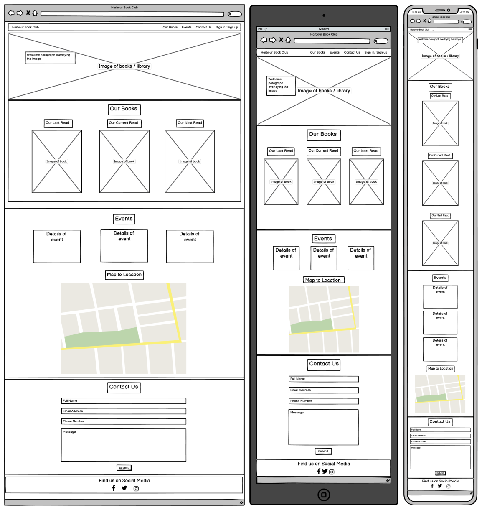
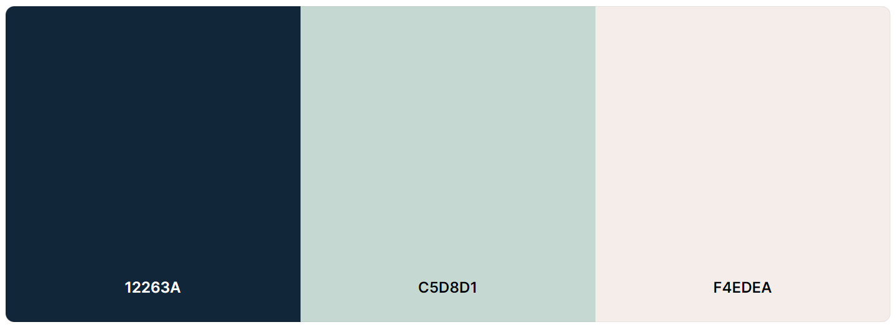

# Harbour Book Club
Harbour Book Club is a simple and user-friendly site developed for readers to find and join this local book club. From the home page users can navigate to different pages which provide information on the kind of books read in the club, the meeting times/dates of the club and a contact form. Users are also able to sign up to the book club from the site.

The site address is: [Harbour Book Club](https://amybiggy.github.io/harbourbookclub/)

## Table of Contents

1. UX
  * Site Purpose
  * Goals
  * Audience
  * Communication
  * Current User Goals
  * New User Goals
 
2. Design
  * Wireframes
  * Color Scheme
  * Typography
  * Imagery

## UX

### Site Purpose
The purpose of the Harbour Book Club website is for readers to find a local book club to join and meet new people who share their hobby.

### Goals

#### Visitor Goals
1. New Users
* Are able to request more information via the contact us form.
* Are able to see dates and times of each meeting.
* Are able to see the location of meetings.
* Are able to see which books the club have recently read / will be reading.
* Are able to get directions to the location using the map.
* Are able to sign up to the meetings.

2. Existing Users
* Are able to see the time and date of the next meeting.
* Can check which book they should currently be reading and which book they will be reading next.

#### Business Goals

The business goals are:
* To attract more people to join the book club.
* To give a clear idea of which books are read during the meetings.
* To make new members feel welcome when joining the club.

### Audience
The site targets readers who are looking for other people who share their hobby and wish to meet on a monthly basis to discuss a specific book. These readers could be any age and from different backgrounds.

### Communication
The website is designed so that anyone would be able to access it and easily identify the information they are looking for. All pages are clearly labelled with the information you would find on there, including the Sign Up button and contact us form.

## Design

#### Wireframes
I started the design process by sketching down my idea to detemine which layout style I thought would work best. I then used the online wireframe website, Basamiq, to create the wireframes which I would work off throughout the project.

#### Colour Scheme
The colour palette was created keeping in mind the name and location of the book club being named “Harbour Book Club” and located in a pub based in a marina. The colours are also not too bright which promotes a relaxing environment for reading.

I have used a different colour backgrounds to define each section.

The main colours are:

#### Typography

I used the same font throughout the site in order to create continuity and to keep the site looking simple and clean. After trying our different fonts, I decided to go with Roboto and used a lighter font weight as I felt it gave the site a classier finish.

#### Imagery
