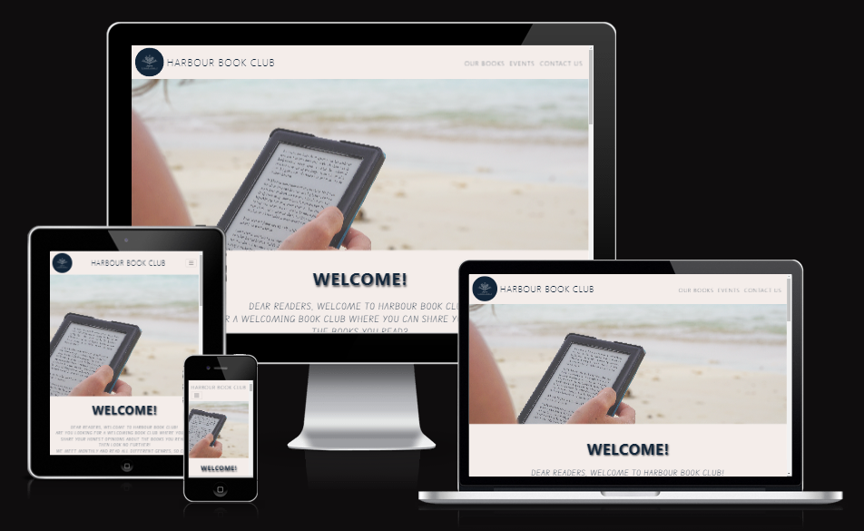
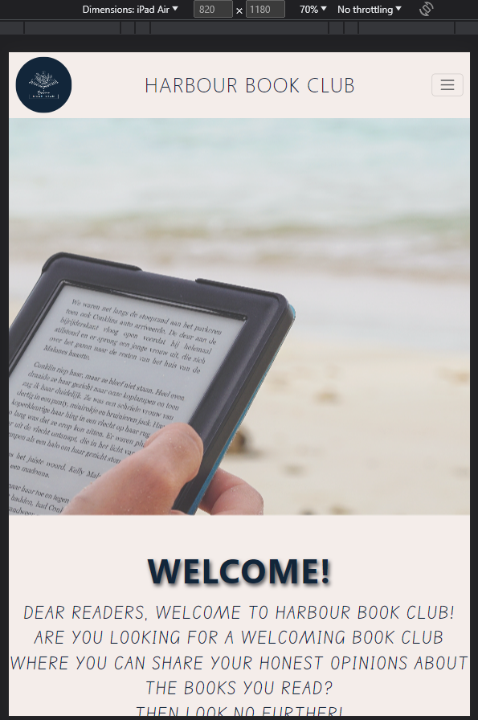
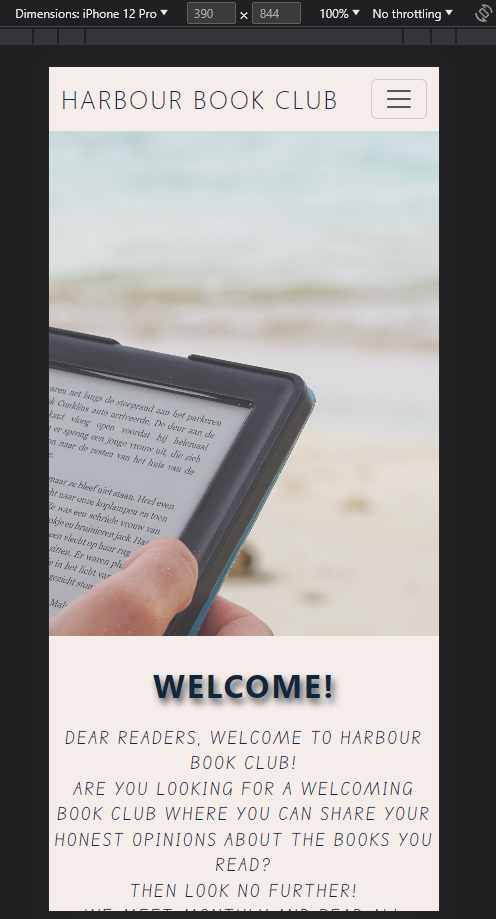
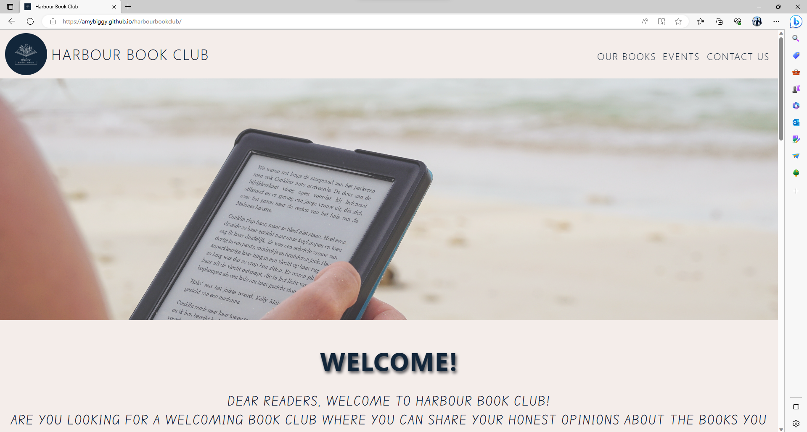
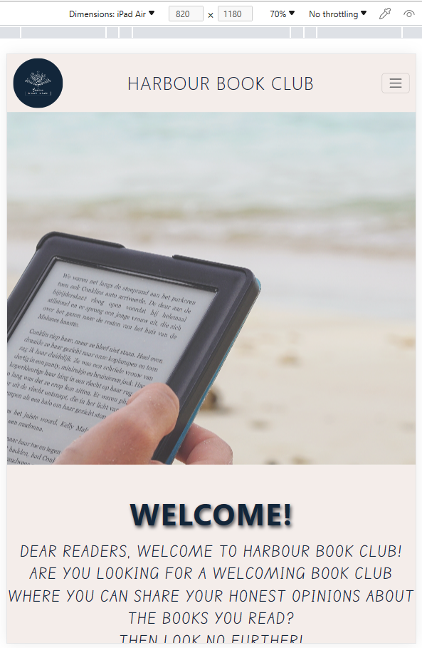
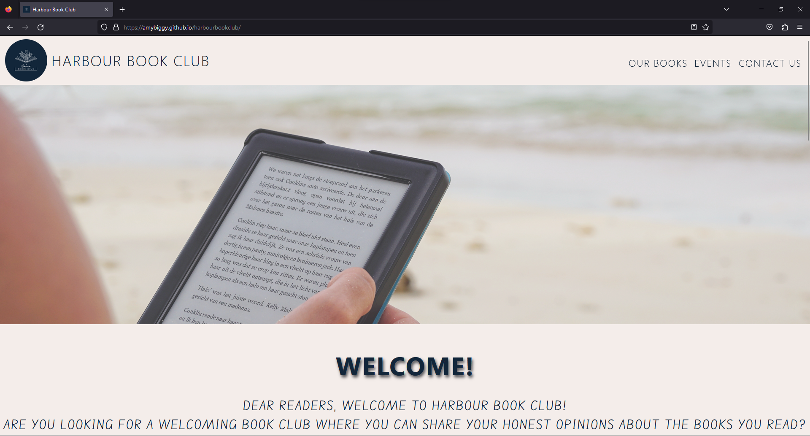

# Harbour Book Club

Harbour Book Club is a simple and user-friendly site developed for readers to find and join this local book club. From the home page users can navigate to different pages which provide information on the kind of books read in the club, the meeting times/dates of the club and a contact form. Users are also able to sign up to the book club from the site.

The site address is: [Harbour Book Club](https://amybiggy.github.io/harbourbookclub/)

## Table of Contents

1. UX

- [Site Purpose](#site-purpose)
- [User Stories](#user-stories)
- [Goals](#goals)
- [Audience](#audience)
- [Communication](#communication)

2. Design

- [Wireframes](#wireframes)
- [Color Scheme](#colour-scheme)
- [Typography](#typography)

3. Testing

- [Browser Testing](#browser-testing)
- [HTML and CSS Validation](#html-and-css-validation)
- [Accessability](#accessability-testing)

4.  [Technologies Used](#technologies-used)

5.  [Deployment](#deployment)

6.  Credits

- [Images](#images)
- [Code](#code)

## UX

### Site Purpose

The purpose of the Harbour Book Club website is for readers to find a local book club to join and meet new people who share their hobby.

### User Stories

As a reader I want:

1. A website that is easy toread and navigate
2. Clear information about the club; where they meet, dates and times, what kind of books are read etc
3. To feel welcome joining a new club

As the owner of the club I want:

1. To provide clear and relevant information regarding the book club
2. To provide a plkace for people to ask any questions they might have regarding the club
3. To give details of meeting and make new members feel welcome to join

### Goals

#### Visitor Goals

1. New Users

- Are able to request more information via the contact us form.
- Are able to see dates and times of each meeting.
- Are able to see the location of meetings.
- Are able to see which books the club have recently read / will be reading.
- Are able to get directions to the location using the map.
- Are able to sign up to the meetings.

2. Existing Users

- Are able to see the time and date of the next meeting.
- Can check which book they should currently be reading and which book they will be reading next.

#### Business Goals

The business goals are:

- To attract more people to join the book club.
- To give a clear idea of which books are read during the meetings.
- To make new members feel welcome when joining the club.

### Audience

The site targets readers who are looking for other people who share their hobby and wish to meet on a monthly basis to discuss a specific book. These readers could be any age and from different backgrounds.

### Communication

The website is designed so that anyone would be able to access it and easily identify the information they are looking for. All pages are clearly labelled with the information you would find on there, including the Sign Up button and contact us form.

## Design

#### Wireframes

I started the design process by sketching down my idea to detemine which layout style I thought would work best. I then used the online wireframe website, Basamiq, to create the wireframes which I would work off throughout the project.

#### Colour Scheme

The colour palette was created keeping in mind the name and location of the book club being named “Harbour Book Club” and located in a pub based in a marina. The colours are also not too bright which promotes a relaxing environment for reading.

I have used a different colour backgrounds to define each section.

The main colours are:

#### Typography

I used the same font for headings and titles throughout the site in order to create continuity and to keep the site looking simple and clean. After trying out different fonts, I decided to go with Roboto and used a lighter font weight as I felt it gave the site a classier finish.

I chose the font Edu SA Beginner for the text parts of the website as I wanted to go with something that was a bit more like a handwriting style, but I still wanted it to be legible.

## Testing

### Browser Testing

I checked my webpage against the 3 top browsers; Google Chrome, Microsoft Edge and Firefox. I checked the webpage for 3 different screen sizes - PC/Laptop, iPad and mobile device

| Browser        | Screen Size |                                                        Image |
| -------------- | :---------: | -----------------------------------------------------------: |
| Chrome         |   Desktop   |   |
|                |    iPad     |      |
|                |   Mobile    |    |
|                |             |                                                              |
| Microsoft Edge |   Desktop   |     |
|                |    iPad     |        |
|                |   Mobile    |      |
|                |             |                                                              |
| Firefox        |   Desktop   |  |
|                |    iPad     |     |
|                |   Mobile    |   |

### HTML and CSS Validation

Once I had finished creating the webpage I ran the code through a HTML and CSS validator to make sure it was correct

### Accessability Testing

I used (pagespeed.web.dev) to check the accessability of my website to check that everything was completely accessible

### Bugs Discovered

When I was checking whether my website was responsive on different screen sizes, I doscovered that anything smaller than a laptop wouldn't show the map or contact form correct so I added in media queries to my CSS and this fixed the issue.

I was having an issue with the text in my header overflowing into the section below due to the vh size I had set on the header image. I changed this size and made it slightly larger which fixed the issue

When viewing my website on smaller screens I was having an issue with the navbar. It was opening fine, but wouldn't collapse back again. I watched a video on youtube and realised that I had the incorrect scripts in my html. I changed these for the correct one and it fixed the issue.

### Peer Review

I submitted my project for review by my peers using the Slack channel and received some positive and contrusctive criticism which I took on board. I would also like to thank my sister who has also provided some points for me to review in order to improve the overall look of my website.

## Technologies Used

I used a variety of technologies throughout the project.

- I used HTML and CSS to create and style the website
- I used [Code Anywhere](https://app.codeanywhere.com/) as the development environment
- I used Bootstrap to create a responsive navbar, contact form and modal [Bootstrap Website](https://getbootstrap.com/)
- I used Github to create a repository for my project [Github Website](https://github.com/)
- I used Balsamiq to design my wireframes [Balsamiq Website](https://balsamiq.com/)

## Deployment

The site was deployed to GitHub pages. To steps I took to deploy the site are as follows:

- In the [GitHub repository](https://github.com/amybiggy/harbourbookclub), go to the Settings tab
- Go to the [Pages tab](https://github.com/amybiggy/harbourbookclub/settings/pages) and select Main Branch in the source selection drop-down menu. Then click "Save"
- The page will be automatically refreshed with a detailed ribbon display to indicate the successful deployment

### Local Deployment

To clone this project into a local IDE, follow these steps:

1. Follow [this link](https://github.com/amybiggy/harbourbookclub) to the GitHub repository
2. Click the green "Code" button and copy the following URL:

- https://github.com/amybiggy/harbourbookclub.git

3. Open the terminal in your local IDE and change the current working directory to the location where you want the cloned directory to be made
4. Type "git clone" and paste the URL that you copied in step 2
5. Press enter and your local clone will be created

## Credits

### Images

I used the book cover images from Amazon for the last, now and next books. They can be found below

- [Amazon link to Fairy Tale book](https://www.amazon.co.uk/Fairy-Tale-Stephen-King/dp/1399705458)
- [Amazon link to The Spanish Love Deception book](https://www.amazon.co.uk/Spanish-Love-Deception-Elena-Armas/dp/B08X7RKXGK)
- [Amazon link to The Silent Patient book](https://www.amazon.co.uk/Silent-Patient-Alex-Michaelides/dp/1409181634)

The image I used for the background of the header is from Unsplash and can be found here:

[Library image](https://unsplash.com/photos/0SYJS6nfR10)

### Code

- Template for Navbar taken from [Bootstrap](https://getbootstrap.com/docs/5.1/components/navbar/) and customised to meet project needs
- Template for contact form taken from [Bootstrap](https://getbootstrap.com/docs/5.1/forms/overview/) and customised to meet project needs
- I watched [this video](https://www.youtube.com/watch?v=4U_AAGHzTok) on how to add the map into my webpage
- Template for modal taken from [Bootstrap](https://getbootstrap.com/docs/5.1/components/modal/) and customised to meet project needs

### Text

I took the blurb for the Stephen King book from [here](<https://en.wikipedia.org/wiki/Fairy_Tale_(novel)#:~:text=Fairy%20Tale%20is%20a%20dark,forces%20of%20good%20and%20evil.>)
I took the blurb for the Elena Armas book from [here](https://www.goodreads.com/book/show/54189398-the-spanish-love-deception) and adapted it to fit onto the website
I took the blurb for the Alex Michaelides book from [here](https://www.amazon.co.uk/Silent-Patient-Alex-Michaelides/dp/1409181634)
