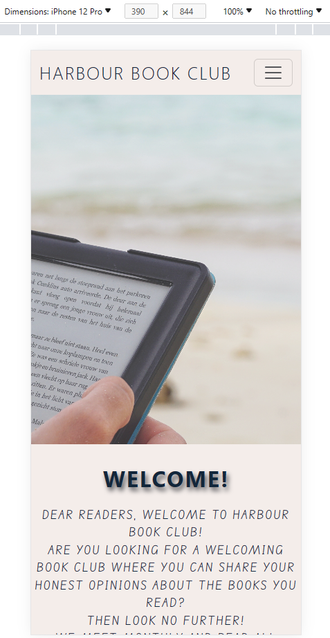
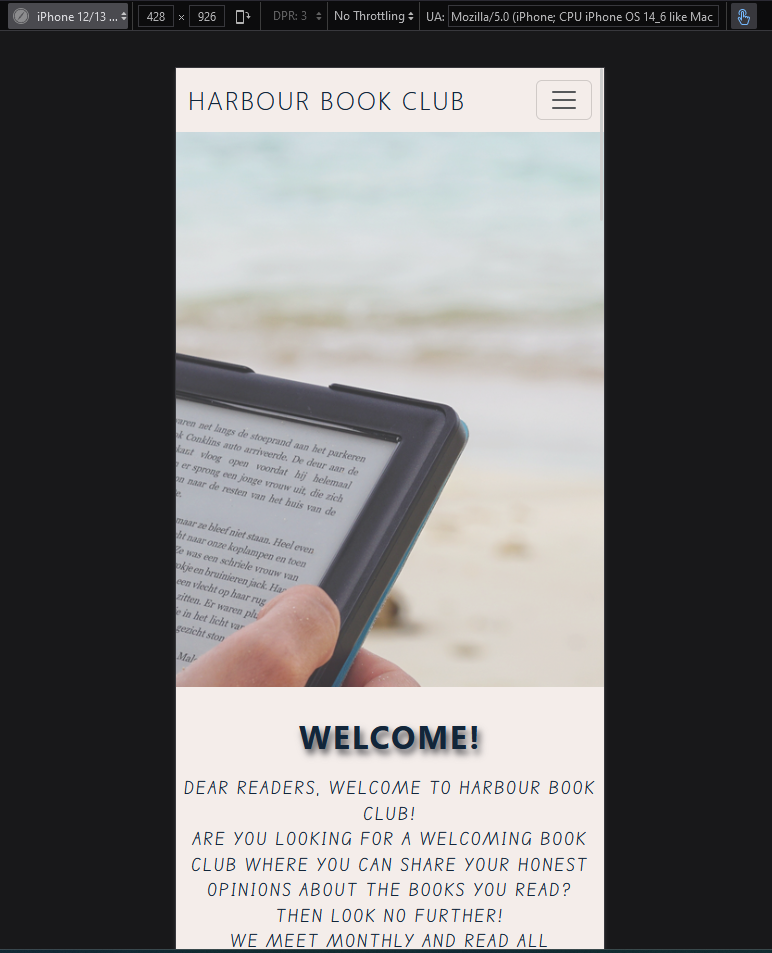
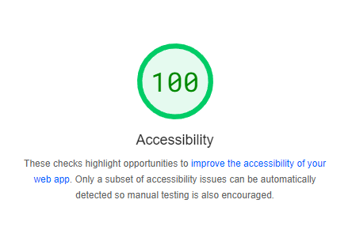

# Testing Phase

Click [here](README.md) to return to the README.md page.

## Testing

### Browser Testing

I checked my webpage against the 3 top browsers; Google Chrome, Microsoft Edge and Firefox. I checked the webpage for 3 different screen sizes - PC/Laptop, iPad and mobile device

| Browser        | Screen Size |                                                        Image |
| -------------- | :---------: | -----------------------------------------------------------: |
| Chrome         |   Desktop   |   |
|                |    iPad     |      |
|                |   Mobile    |    |
|                |             |                                                              |
| Microsoft Edge |   Desktop   |     |
|                |    iPad     |        |
|                |   Mobile    |      |
|                |             |                                                              |
| Firefox        |   Desktop   |  |
|                |    iPad     |     |
|                |   Mobile    |   |

### HTML and CSS Validation

Once I had finished creating the webpage I ran the code through a HTML and CSS validator to make sure it was correct

### Accessability Testing

I used (pagespeed.web.dev) to check the accessability of my website to check that everything was completely accessible

### User Stories

| User Story                                                                                           | Testing                                                                                                                                                                                                           |
| ---------------------------------------------------------------------------------------------------- | ----------------------------------------------------------------------------------------------------------------------------------------------------------------------------------------------------------------- |
| A website that is easy to read and navigate.                                                         | The fonts chosen for the website are clear and legible. The navbar is clear and sticks to the top of the page making it easier to navigate no matter where you are on the page or what size screen you are using. |
| Clear information about the club; where they meet, dates and times, what kind of books are read etc. | This information is easily found on the website in the different relevant sections.                                                                                                                               |
| To feel welcome joining a new club.                                                                  | There is a welcome message at the top of the website encouraging new members to join the book club.                                                                                                               |
| To be able to contact the book club if I have any questions.                                         | The contact form allows new and existing users to contact the owners of the book club easily. Once the form is submitted, users are then directed to a thank you page giving details of next steps.               |
| To provide clear and relevant information regarding the book club.                                   | The website gives new and existing users all information they would need if they wanted to join the book club. It shows where the book club is held and which books they will be reading.                         |
| To provide a place for people to ask any questions they might have regarding the club.               | There is a contact us form on the website.                                                                                                                                                                        |
| To give details of meeting and make new members feel welcome to join.                                | The welcome message is short and sweet inviting readers to join the club.                                                                                                                                         |

### Bugs Discovered

When I was checking whether my website was responsive on different screen sizes, I doscovered that anything smaller than a laptop wouldn't show the map or contact form correct so I added in media queries to my CSS and this fixed the issue.

I was having an issue with the text in my header overflowing into the section below due to the vh size I had set on the header image. I changed this size and made it slightly larger which fixed the issue

When viewing my website on smaller screens I was having an issue with the navbar. It was opening fine, but wouldn't collapse back again. I watched a video on youtube and realised that I had the incorrect scripts in my html. I changed these for the correct one and it fixed the issue.

### Peer Review

I submitted my project for review by my peers using the Slack channel and received some positive and contrusctive criticism which I took on board. I would also like to thank my sister who has also provided some points for me to review in order to improve the overall look of my website.
